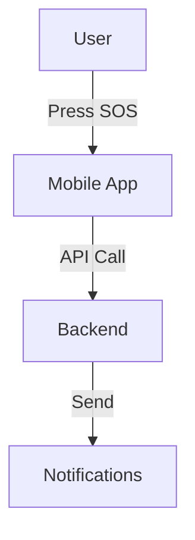

# Documentation Instructions

## Documentation Structure

The project documentation is organized in the `docs/` directory:

- `WIKI.md` - Comprehensive project documentation
- `ARCHITECTURE.md` - System architecture and design
- `SETUP.md` - Development setup instructions
- `DEPLOYMENT.md` - Deployment procedures
- `BRANCH_STRATEGY.md` - Git workflow and branch management
- `CONTRIBUTING.md` - Contribution guidelines
- `STRUCTURE.md` - Repository structure overview
- `CICD-SUMMARY.md` - CI/CD pipeline documentation
- `QUICKSTART-DEPLOY.md` - Quick deployment guide

## Writing Style

### Tone
- Clear and concise
- Professional but approachable
- Assume reader has basic technical knowledge
- Explain complex concepts simply

### Structure
- Use hierarchical headings (##, ###, ####)
- Start with overview/introduction
- Include practical examples
- Add code snippets where helpful
- End with next steps or resources

### Formatting

**Code Blocks:**
```markdown
```bash
command here
\```

```csharp
code here
\```

```dart
code here
\```
```

**Lists:**
- Use `-` for unordered lists
- Use `1.` for ordered lists
- Indent sub-items with 2 spaces

**Emphasis:**
- **Bold** for important terms
- *Italic* for emphasis
- `code` for inline code or file names

**Links:**
- Use descriptive text: `[Setup Guide](SETUP.md)`
- External links: `[Flutter Docs](https://flutter.dev)`

## Updating Documentation

### When to Update

Update documentation when:
1. Adding new features
2. Changing setup/build process
3. Modifying architecture
4. Adding dependencies
5. Changing deployment process
6. Updating configuration

### What to Update

**New Feature:**
- Add to relevant documentation file
- Update WIKI.md overview if significant
- Add to ARCHITECTURE.md if architectural change
- Update SETUP.md if new dependencies

**Configuration Change:**
- Update SETUP.md
- Update environment variable lists
- Update secrets documentation in CI/CD files

**Architecture Change:**
- Update ARCHITECTURE.md
- Update diagrams if applicable
- Document reasoning for change
- Update related documentation

### Documentation Checklist

Before committing documentation changes:

- [ ] Check spelling and grammar
- [ ] Verify all code examples work
- [ ] Test all commands and scripts
- [ ] Ensure links are not broken
- [ ] Check formatting renders correctly
- [ ] Update table of contents if needed
- [ ] Review for clarity and completeness

## Code Examples

### Good Example
```markdown
### Running Tests

To run backend tests:

```bash
cd backend
dotnet test
\```

This will:
- Restore dependencies
- Build the project
- Run all test projects
- Display results in console

For coverage report:

```bash
dotnet test --collect:"XPlat Code Coverage"
\```
```

### Bad Example
```markdown
### Tests

Run tests:
```bash
dotnet test
\```
```

## Diagrams and Visual Aids

### ASCII Diagrams
Use for simple architecture/flow diagrams:
```
┌─────────────┐
│   Mobile    │
│     App     │
└──────┬──────┘
       │ HTTP
       ▼
┌─────────────┐
│   Backend   │
│     API     │
└─────────────┘
```

### Mermaid Diagrams
Use for complex flows (GitHub supports Mermaid):
````markdown

````

## README.md Maintenance

The main README.md is automatically updated by CI/CD workflows with:
- Latest version information
- Deployment status
- Recent commits
- Service health status

**Do not manually edit** the deployment sections. They are managed by:
- `backend-cicd.yml` workflow
- Automated version tagging
- Deployment scripts

### Manual Updates to README

You can manually update:
- Project description
- Features list
- Quick start commands
- Documentation links
- License information
- Contact information

## Cross-References

Always link related documentation:
```markdown
See [Architecture Documentation](ARCHITECTURE.md) for more details.

For setup instructions, refer to [Setup Guide](SETUP.md).

Learn about our [Branch Strategy](BRANCH_STRATEGY.md).
```

## Version Documentation

When creating release documentation:

1. **What changed:** List new features and fixes
2. **Breaking changes:** Highlight incompatibilities
3. **Migration guide:** How to upgrade
4. **Dependencies:** New/updated packages
5. **Known issues:** Current limitations

Format:
```markdown
## v2025.11.13

### Features
- Added emergency contact management
- Improved location accuracy

### Bug Fixes
- Fixed notification delivery
- Resolved crash on startup

### Breaking Changes
- Changed API endpoint structure
- Updated authentication flow

### Migration Guide
1. Update mobile app to v1.2.0
2. Clear app cache
3. Re-authenticate users
```

## API Documentation

API documentation is auto-generated via Swagger. When adding/modifying endpoints:

1. Add XML comments to controllers:
```csharp
/// <summary>
/// Creates a new emergency alert
/// </summary>
/// <param name="request">Emergency details</param>
/// <returns>Created emergency</returns>
/// <response code="201">Emergency created successfully</response>
/// <response code="400">Invalid request</response>
[HttpPost]
[ProducesResponseType(StatusCodes.Status201Created)]
[ProducesResponseType(StatusCodes.Status400BadRequest)]
public async Task<ActionResult<EmergencyDto>> Create([FromBody] CreateEmergencyRequest request)
```

2. Document request/response models:
```csharp
/// <summary>
/// Request to create an emergency
/// </summary>
public class CreateEmergencyRequest
{
    /// <summary>
    /// User's current location
    /// </summary>
    [Required]
    public LocationDto Location { get; set; }
    
    /// <summary>
    /// Type of emergency
    /// </summary>
    [Required]
    public EmergencyType Type { get; set; }
}
```

## Resources

- [GitHub Flavored Markdown](https://github.github.com/gfm/)
- [Mermaid Documentation](https://mermaid.js.org/)
- [Writing Technical Documentation](https://developers.google.com/tech-writing)
